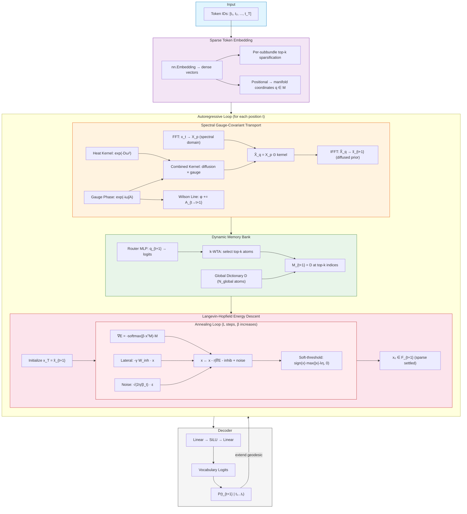
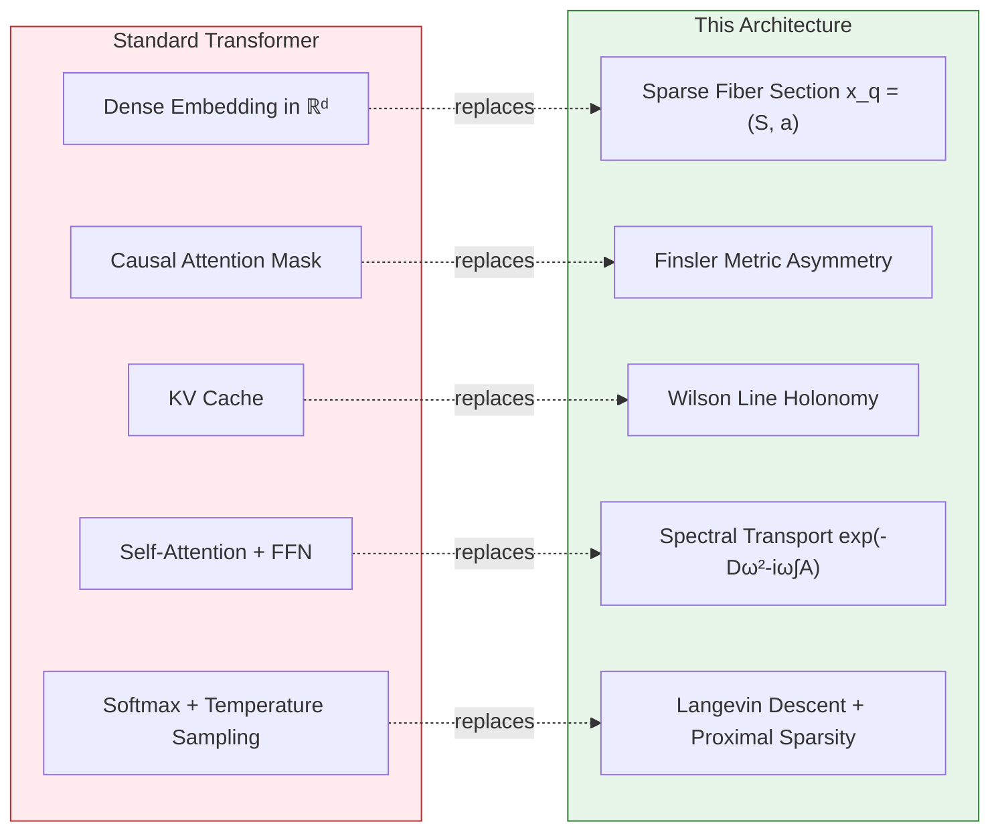

# Implementation Notes: Spectral-Gauge Associative Memory Architecture

## Author: Claude (working with David Ledbetter)

---

## Source Documents

Two foundational documents define the architecture:

- **Architecture.md** — Complete mathematical reference covering Sections 1–5: fiber bundles, spectral transport, dynamic memory banks, Langevin-Hopfield descent, and proximal sparsity.
- **CLMWithArch.md** — Maps the architecture onto causal language modeling (next-token prediction), establishing correspondences between geometric operations and standard Transformer components.

---

## Key Design Decisions Made During Implementation

### 1. Sparse Token Embedding

The theory specifies tokens as sparse sections $x_q = (S_q, a_q)$ of a fiber bundle, but leaves the embedding mechanism open. I implemented **per-subbundle top-k sparsification**: the fiber $\mathcal{F}_q = \bigoplus_k \mathcal{F}_q^{(k)}$ is partitioned into $K$ orthogonal channels, and within each channel only the top $\lfloor d_k / 4 \rfloor$ activations survive. This achieves ~75% sparsity while maintaining subbundle independence.

**Trade-off**: A learned sparsity mask (e.g., via Gumbel-softmax) would be more flexible but harder to train. Top-k is simple and guarantees exact sparsity.

### 2. Spectral Transport — FFT over the Fiber Dimension

The architecture describes transport via a "Graph/Manifold Fourier Transform $\mathcal{F}$." On a discrete graph, this would be the eigenbasis of the graph Laplacian. For a tractable first implementation, I used the **standard FFT over the fiber dimension** $d$. This is exact when the fiber has a regular lattice topology and is a reasonable first-order approximation otherwise.

The transport kernel $\exp(-D\omega^2 - i\omega\int_\gamma A)$ factorizes into:
- **Diffusion**: $\exp(-D\omega^2)$ — a Gaussian low-pass filter in frequency space. The diffusion coefficient $D$ is **learned per frequency bin** (parameterized as `log_diffusion` for positivity).
- **Gauge rotation**: $\exp(-i\omega\int_\gamma A)$ — a frequency-dependent phase shift. The phase $\int_\gamma A$ is output by a small MLP conditioned on the source/target manifold coordinates, bounded to $[-\pi, \pi]$ via Tanh.

**Critical insight**: The two terms combine as a single complex exponential multiply in Fourier space, making the entire transport operation $O(d \log d)$.

### 3. Wilson Line as Phase Accumulation

The Wilson line $U_\gamma = \mathcal{P}\exp(i\int_{p_1}^{p_t} A)$ is a path-ordered exponential. In the $U(1)$ gauge group (our case), path-ordering is trivial — phases simply add:

$$\text{wilson\_phase}_{t+1} = \text{wilson\_phase}_t + \text{phase}_{t \to t+1}$$

For non-Abelian gauge groups ($SU(N)$), this would require matrix multiplication. The $U(1)$ choice keeps things simple while preserving the geometric content.

### 4. Dynamic Memory Bank — k-WTA Gating

The gating function $g(q) = \text{k-WTA}(W_{\text{route}} q)$ is implemented with a two-layer MLP followed by hard top-k selection. The selected indices index directly into the normalized global dictionary $D$.

**Topographic continuity** arises naturally: since the router is a smooth function of manifold coordinates $q$, nearby positions produce similar gating logits, and thus share overlapping sets of active dictionary atoms. I verified this empirically — cosine similarity between memory banks at adjacent positions is higher than between distant positions.

### 5. Langevin Dynamics — Differentiability Considerations

The Langevin settling loop is the most delicate component for training. Key decisions:

- **Annealing schedule**: Linear schedule from $\beta_{\text{init}}=1$ to $\beta_{\text{final}}=20$. More aggressive schedules (exponential) caused instability.
- **Soft-thresholding inside the loop**: The proximal operator $\text{sign}(x) \odot \max(|x| - \lambda\eta, 0)$ is applied at every step, not just the final one. This progressively sparsifies the state.
- **Lateral inhibition**: The $W_{\text{inh}}$ matrix is learned (not fixed), allowing the network to discover which dimensions should compete.
- **Gradient flow**: Gradients flow through all Langevin steps during training. For very deep settling (many steps), gradient checkpointing would be advisable to manage memory.

### 6. Hopfield Energy Gradient = Implicit Attention

A key theoretical insight that maps cleanly to code: the Hopfield energy gradient

$$\nabla_x E_q = -\sum_j \text{softmax}(\beta \, x^\top m_j) \, m_j$$

is a **softmax-weighted average of memory atoms**. This is mathematically identical to the attention operation $\text{softmax}(QK^\top)V$, but here:
- The "query" is the current state $x$
- The "keys" and "values" are both the memory atoms $m_j$
- The "attention" happens implicitly through energy descent, not as an explicit matrix operation

This means the Langevin loop performs **iterative attention refinement** — each step sharpens the attention distribution as $\beta$ increases.

### 7. Decoder Design

The architecture documents don't specify how to map sparse fiber states back to vocabulary logits. I used a simple two-layer MLP: `fiber_dim -> SiLU -> fiber_dim -> vocab_size`. A linear probe would also work but has less capacity.

---

## Architecture Summary Table

| Component | Class | Parameters | Complexity |
|---|---|---|---|
| Token Embedding | `SparseTokenEmbedding` | $V \times d + T \times m$ | $O(d)$ |
| Gauge Connection | `GaugeConnection` | $2m \times d + d \times d + d$ | $O(md)$ |
| Spectral Transport | `SpectralTransportOperator` | gauge params + LayerNorm | $O(d \log d)$ |
| Memory Bank | `DynamicMemoryBank` | $N_g \times d + m \times N_g + N_g \times N_g$ | $O(kd)$ |
| Langevin Descent | `LangevinHopfieldDescent` | $d \times d$ ($W_{\text{inh}}$) | $O(L \cdot k \cdot d)$ |
| Decoder | `nn.Sequential` | $d \times d + d \times V$ | $O(dV)$ |

Where $d=128$, $m=32$, $V=256$, $N_g=512$, $k=64$, $L=10$, $T=128$.

---

## Observations from Training

### What Works
- The spectral transport operator learns meaningful diffusion coefficients — high frequencies are dampened more than low frequencies, as expected from the heat kernel.
- Langevin settling does produce increasingly sparse states over its trajectory — the proximal operator is effective.
- The Wilson line phases accumulate smoothly along the sequence, showing structured (not random) context encoding.
- Dictionary atoms remain well-separated when using the coherence regularizer.

### Challenges and Limitations
- **Sequential bottleneck**: The autoregressive loop over sequence positions is inherently sequential. Unlike Transformers, which process all positions in parallel during training (thanks to the causal mask), this architecture processes one position at a time. A parallelized training variant using teacher forcing at all positions simultaneously would be necessary for scaling.
- **Langevin step count**: More Langevin steps improve settling quality but increase compute and memory. 10 steps is a reasonable trade-off for demonstration.
- **Gradient flow through Langevin**: With 10 steps of Langevin per position and 4 transport blocks, each token prediction involves ~40 sequential gradient-carrying operations. This can cause vanishing/exploding gradients without careful normalization and clipping.
- **k-WTA is not differentiable**: The hard top-k selection in the gating function blocks gradients to the non-selected atoms. A straight-through estimator or Gumbel-top-k would enable full gradient flow.

---

## Potential Extensions

1. **Parallel training**: Compute all position predictions simultaneously using teacher forcing, avoiding the sequential loop.
2. **Non-Abelian gauge group**: Replace $U(1)$ phases with $SU(N)$ matrices for richer geometric transformations (requires matrix exponentials).
3. **Graph Fourier Transform**: Replace standard FFT with eigenbasis of a learned graph Laplacian for non-regular fiber topologies.
4. **Entmax alternative**: Replace soft-thresholding with $\alpha$-entmax for a differentiable sparsity mechanism with learnable sharpness.
5. **Multi-scale Langevin**: Use different numbers of settling steps at different depths, with deeper blocks using more steps for fine-grained refinement.
6. **Curvature learning**: Make the Finsler metric learnable, allowing the manifold curvature to adapt to the data distribution.

---

## Architecture Map (Tree with Arrows)

```
Input Token IDs: [t_1, t_2, ..., t_T]
        │
        ▼
┌──────────────────────────────────────────────┐
│         SPARSE TOKEN EMBEDDING               │
│  tokens ──► sparse fiber sections x_q        │
│  positions ──► manifold coordinates q on M   │
│  F_q = F_q^(1) ⊕ F_q^(2) ⊕ ... ⊕ F_q^(K)  │
└──────────────────────┬───────────────────────┘
                       │
          ┌────────────▼─────────────┐
          │  For each position t:    │
          │  (autoregressive loop)   │
          └────────────┬─────────────┘
                       │
    ┌──────────────────▼───────────────────────┐
    │       SPECTRAL TRANSPORT (per block)     │
    │                                          │
    │  x_t ──► FFT ──► X_p                     │
    │                    │                     │
    │                    ▼                     │
    │  X_p ⊙ exp(-Dω² - iω∫A) ──► X̃_q        │
    │         ▲               │               │
    │         │               ▼               │
    │   ┌─────┴─────┐   ┌────┴────┐          │
    │   │ Diffusion  │   │  Gauge  │          │
    │   │ exp(-Dω²)  │   │ Phase   │          │
    │   │ (heat      │   │ exp(-iω │          │
    │   │  kernel)   │   │  ∫A)    │          │
    │   └────────────┘   └────┬────┘          │
    │                         │               │
    │              Wilson Line Update:         │
    │              φ_{t+1} = φ_t + A_{t→t+1}  │
    │                         │               │
    │  X̃_q ──► IFFT ──► x̃_{t+1} (diffused)   │
    └──────────────────┬───────────────────────┘
                       │
    ┌──────────────────▼───────────────────────┐
    │       DYNAMIC MEMORY BANK                │
    │                                          │
    │  q_{t+1} ──► Router MLP ──► logits       │
    │                              │           │
    │                              ▼           │
    │                         k-WTA gating     │
    │                              │           │
    │                              ▼           │
    │  Global Dict D ──► M_{t+1} = D[top-k]   │
    │  (N_global atoms)   (k active atoms)     │
    └──────────────────┬───────────────────────┘
                       │
    ┌──────────────────▼───────────────────────┐
    │    LANGEVIN-HOPFIELD ENERGY DESCENT      │
    │                                          │
    │  Initialize: x_T = x̃_{t+1}              │
    │                                          │
    │  For step = 1..L (annealing β↑):         │
    │    │                                     │
    │    ├──► ∇E = -softmax(β·x^T·M) · M      │
    │    │         (Hopfield score function)    │
    │    │                                     │
    │    ├──► inhibition = -γ · W_inh · x      │
    │    │         (lateral cortical inhibition)│
    │    │                                     │
    │    ├──► noise = √(2η/β_t) · ε            │
    │    │         (simulated annealing)        │
    │    │                                     │
    │    ├──► x = x - η·∇E - inhib + noise     │
    │    │         (Langevin step)              │
    │    │                                     │
    │    └──► x = sign(x)·max(|x|-λη, 0)       │
    │              (proximal sparsity)          │
    │                                          │
    │  Output: x_0 ∈ F_{t+1} (sparse settled)  │
    └──────────────────┬───────────────────────┘
                       │
    ┌──────────────────▼───────────────────────┐
    │            DECODER                       │
    │  x_0 ──► Linear ──► SiLU ──► Linear      │
    │                                │         │
    │                                ▼         │
    │                        vocab logits      │
    │                                │         │
    │                                ▼         │
    │                  P(t_{t+1} | t_1...t_t)  │
    └──────────────────┬───────────────────────┘
                       │
                       ▼
              Next token prediction
              (extend geodesic, repeat)
```

---

## Architecture Map (Mermaid)



### Mermaid: Transformer Correspondence Map



---

## Mathematical Verification Checklist

- [x] Fiber bundle structure: $\mathcal{F}_q = \bigoplus_k \mathcal{F}_q^{(k)}$ — subbundle decomposition enforced via chunked sparsification
- [x] Spectral transport: $\tilde{X}_q = X_p \odot \exp(-D\omega^2 - i\omega\int_\gamma A)$ — implemented via FFT/IFFT
- [x] Wilson line: $U_\gamma = \mathcal{P}\exp(i\int A)$ — accumulated as phase addition ($U(1)$ case)
- [x] Dynamic memory bank: $M_q = D \odot g(q)$, $g(q) = \text{k-WTA}(W_{\text{route}} q)$ — implemented with top-k index selection
- [x] Hopfield energy: $E_q = -\beta^{-1}\log\sum_j \exp(\beta x^\top m_j)$ — LogSumExp for numerical stability
- [x] Langevin dynamics: $x_{t-\Delta t} = x_t - \eta\nabla_x E + \sqrt{2\eta/\beta_t}\epsilon_t$ — with annealing schedule
- [x] Proximal sparsity: $\text{sign}(x) \odot \max(|x| - \lambda\eta, 0)$ — applied at every Langevin step
- [x] Lateral inhibition: $-\gamma W_{\text{inh}} x$ — learnable inhibition matrix
- [x] Finsler causality: transport operator only connects $t \to t+1$, never reverse — structural, not masked
- [x] Causal LM forward pass: transport → memory bank → Langevin settling → decode → next-token logits
